# inference-bench: serving engine benchmarks on Akamai Cloud GPUs

Reproducible, disposable benchmarking of LLM serving engines on a single
Akamai Cloud (Linode) GPU instance. Terraform builds the node, cloud-init
installs the NVIDIA stack, a suite runner starts each engine in turn and
drives it with guidellm at fixed concurrency levels, and offline tools turn
the results into cost per million tokens and a markdown report with charts.

Engines: vLLM, SGLang, TGI, Ollama, llama.cpp, NVIDIA NIM.
Default model: Llama 3.1 8B Instruct. Default plan: RTX 4000 Ada, 0.52 USD/hr.

Independent project. Not affiliated with, sponsored by, or endorsed by Akamai
Technologies, NVIDIA, or any engine vendor. Product names are used to identify
the systems under test. Published results, when added, are the output of the
code in this repository and can be reproduced by anyone with an account, as
described in the reproduction guide.

## Purpose

Competitive and technical marketing claims about inference platforms are
only worth what an outside engineer can reproduce. This repository is a
worked example of that standard: the infrastructure, the exact engine
builds, the workloads, the load generator version and the cost formula are
all in version control, and a report cannot be produced without recording
them. The same harness extends to a second provider for like-for-like
comparisons (see [methodology.md](docs/methodology.md)).

## Contents

- [Purpose](#purpose)
- [Quick start](#quick-start)
- [What a run produces](#what-a-run-produces)
- [Cost control](#cost-control)
- [Repository layout](#repository-layout)
- [Documentation](#documentation)
- [Status and known gaps](#status-and-known-gaps)

## Quick start

Complete [docs/prerequisites.md](docs/prerequisites.md) first. It is
written so an engineer outside the project can reproduce a published run on
their own Akamai account: account setup, GPU plan access ticket, API token,
Hugging Face license, local tools, tfvars, and what must match for the
comparison to be valid. GPU plans are gated on new accounts, so open that
ticket before anything else.

```bash
export LINODE_TOKEN=...            # never written to disk by this repo
export TF_VAR_hf_token=...         # optional; gated models only

cp terraform/terraform.tfvars.example terraform/terraform.tfvars
# edit allowed_cidrs to the operator's public IP /32 (preflight prints it)

make preflight                     # token, plan, region capabilities, live price
make provision                     # apply, then wait for driver + reboot (5 to 10 min)
make guard HOURS=3                 # second terminal: destroys after 3 hours regardless
make smoke                         # vLLM only, tiny workload, about 5 minutes incl. model pull
make log                           # follow the remote suite
make fetch && make analyze         # cost.csv and REPORT.md under results/<run-id>/
make suite                         # five engines x two workloads
make destroy                       # fetch, then terraform destroy
```

Every script accepts -h for usage and --debug for a support bundle under
/var/tmp/chr-diag/.

## What a run produces

```
results/<run-id>/
  run.json                    model, plan, region, engines, workloads, timestamps
  nvidia-smi-q.txt            driver, GPU, clocks
  <engine>/meta.json          image, RepoDigest, precision, engine args, driver
  <engine>/<workload>/c<N>/   guidellm.json, gpu.csv (1 Hz), engine-tail.log, command.txt
  cost.csv, cost.json         USD per 1M output tokens per point   (analyze/cost.py)
  REPORT.md                   tables, Mermaid charts, auto caveats (analyze/report.py)
```

Metrics per point: TTFT p50/p99, ITL, TPOT, output tokens/s, requests/s,
error count, GPU utilization and memory, cost per million tokens.

## Why this shape

- **Single node, one engine at a time.** Tightest control of variables and
  the cheapest way to compare engines. An LKE variant is the next layer.
- **guidellm, not a custom client.** Maintained inside the vLLM project,
  engine-agnostic, reports the metrics vendors quote. See
  [oss-landscape.md](docs/oss-landscape.md) for what else exists and why
  it was or was not used.
- **The 200x200 workload copies Akamai's own published benchmark shape**
  (NIM on TensorRT-LLM, 200 in / 200 out, concurrency 1, 100, 200) so
  results can be set next to the vendor's numbers. See
  [references.md](docs/references.md).
- **Spend is bounded by design.** See the next section.

## Cost control

- Akamai bills allocated instances whether powered on or off. Only
  destroy stops charges. bin/budget-guard.sh sleeps N hours, fetches
  results, and runs terraform destroy with auto-approve.
- Default plan is the cheapest 20 GB GPU. A full five-engine, two-workload
  suite runs in roughly two hours including image and model pulls: about
  1.50 USD at list price.
- The Cloud Firewall admits SSH from the operator CIDR only. Engine ports
  bind to loopback on the host; use `bin/ssh.sh --tunnel` to reach them.
- No token or key is stored in the repository. Terraform reads
  LINODE_TOKEN from the environment; HF and NGC tokens land only in
  /opt/bench/env on the instance (mode 0600) and die with it.

## Repository layout

```mermaid
%%{init: {"theme": "base", "themeVariables": {"fontSize": "13px", "background": "#002b36", "primaryColor": "#073642", "primaryTextColor": "#eee8d5", "primaryBorderColor": "#586e75", "lineColor": "#586e75", "secondaryColor": "#073642", "tertiaryColor": "#002b36", "noteBkgColor": "#073642", "noteTextColor": "#eee8d5", "noteBorderColor": "#586e75"}}}%%
flowchart TB
    ROOT["inference-bench"]
    TF["terraform/<br/>instance, firewall, cloud-init template"]
    BIN["bin/<br/>operator scripts (preflight, provision, sync,<br/>run-remote, fetch-results, budget-guard, destroy, ssh)"]
    HOST["host/<br/>runs on the GPU node: engine.sh, run-suite.sh,<br/>run-bench.sh, wait-healthy.sh, gpu-sampler.sh"]
    PROF["profiles/<br/>engines/*.env, workloads/*.json, pricing.json"]
    AN["analyze/<br/>cost.py, report.py, lib/"]
    DOCS["docs/<br/>architecture, methodology, engines,<br/>cost-model, oss-landscape, diagrams/"]
    RES["results/<br/>fetched runs (gitignored)"]
    ROOT --> TF
    ROOT --> BIN
    ROOT --> HOST
    ROOT --> PROF
    ROOT --> AN
    ROOT --> DOCS
    ROOT --> RES
    classDef primary  fill:#073642,stroke:#268bd2,stroke-width:2px,color:#eee8d5
    classDef success  fill:#073642,stroke:#859900,stroke-width:2px,color:#eee8d5
    classDef warning  fill:#073642,stroke:#b58900,stroke-width:2px,color:#eee8d5
    classDef security fill:#073642,stroke:#6c71c4,stroke-width:2px,color:#eee8d5
    classDef neutral  fill:#073642,stroke:#586e75,stroke-width:2px,color:#eee8d5
    class ROOT primary
    class TF security
    class BIN,HOST success
    class PROF,AN,RES warning
    class DOCS neutral
```



## Documentation

| Document | Content |
| --- | --- |
| [Prerequisites and reproduction guide](docs/prerequisites.md) | For an outside engineer validating published results on their own account: setup, what must match, first run, comparing and reporting |
| [Architecture](docs/architecture.md) | Component and sequence diagrams, data flow, trust boundaries |
| [Methodology](docs/methodology.md) | Controlled variables, metric definitions, honesty checklist, extending to a second provider |
| [Engines](docs/engines.md) | Per-engine notes, image pins, memory budget on a 20 GB GPU, adding an engine |
| [Cost model](docs/cost-model.md) | Formula, what it omits and how to add it, comparing providers |
| [OSS landscape](docs/oss-landscape.md) | guidellm, inference-perf, GenAI-Perf, InferenceX, MLPerf: what is reused and what is original |
| [References](docs/references.md) | Akamai's published benchmark to reproduce, plan and price sources, every OSS project and engine linked |

## Status and known gaps

Built and validated offline on 2026-09-27: terraform validate passes, all
scripts pass bash -n, the analysis tools run against a synthetic fixture,
and the diagrams render. Not yet executed against a live Akamai account.
Expect the first live run to surface:

- guidellm 0.7.x CLI flag names. run-bench.sh detects the installed CLI
  shape and adapts; confirm against `guidellm run --help` on the host.
- Engine image tags. Only vLLM is pinned by default; pin SGLANG_TAG,
  TGI_TAG, OLLAMA_TAG, LLAMACPP_TAG before a reportable run. Digests are
  recorded regardless.
- NIM on a 20 GB GPU may not have a fitting profile; it is excluded from
  the default engine list.
- pricing.json values are list prices from public sources; preflight
  compares them to the live API and warns on drift.

Next steps: run the smoke target, then the full suite with --repeat 3; add
an LKE variant (GPU node pool, inference-perf as a Kubernetes job, DCGM
exporter); add a second provider's terraform/ for a like-for-like
provider comparison.
