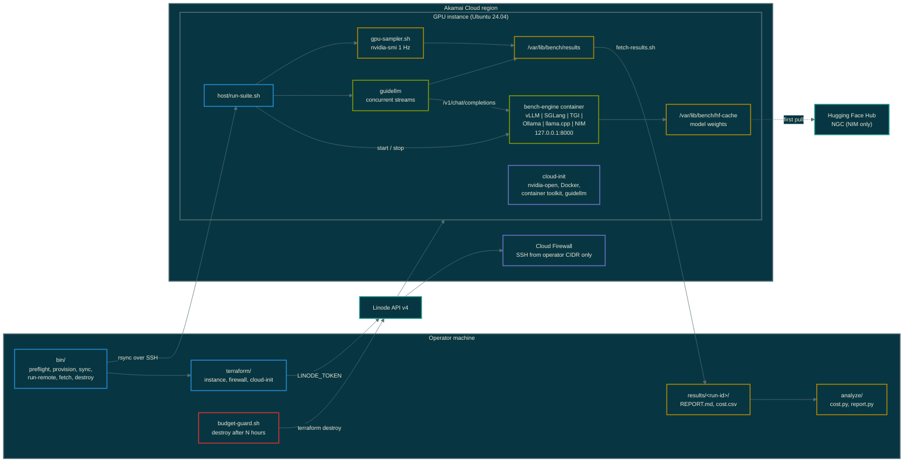
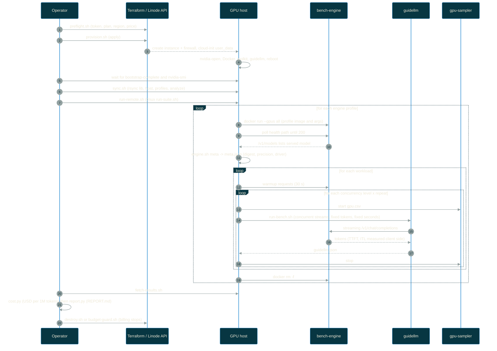

# Architecture

## Components

Operator machine holds Terraform state, orchestration scripts and analysis.
The GPU instance holds only what a run needs and is destroyed afterwards.
The load generator runs on the instance, over loopback, so network latency
between operator and region never enters the measurements.

## Suite run sequence

## Trust boundaries

| Boundary | Control |
| --- | --- |
| Operator to Linode API | LINODE_TOKEN from the environment; never in files |
| Internet to instance | Cloud Firewall: inbound DROP except TCP 22 from allowed_cidrs; optional TCP 8000 |
| Host to engine | Engine container port published on 127.0.0.1 only; ufw allows SSH only |
| Secrets on host | /opt/bench/env mode 0600, root only; destroyed with the instance |
| Model weights | Hugging Face cache on the instance disk; nothing copied back |
| Results | Fetched to results/ (gitignored); contain no secrets, only metrics and logs |

## Design choices

- **Containers per engine, not a Kubernetes cluster.** One node, one
  engine at a time, is the tightest control of variables and the cheapest
  way to compare engines. The Kubernetes variant (LKE plus inference-perf)
  is the next layer, not the first.
- **guidellm instead of a custom client.** See docs/oss-landscape.md.
- **Closed-loop concurrency.** Matches how vendors quote numbers
  (Akamai's Blackwell blog: C = 1, 100, 200) and is stable at saturation.
- **Collect on the host, analyze offline.** Same split as the rest of the
  platform toolkit: raw evidence is fetched once and can be re-analyzed
  without cluster or cloud access.
- **Destroy-based budget guard.** Powered-off instances bill; only destroy
  is a real stop.
